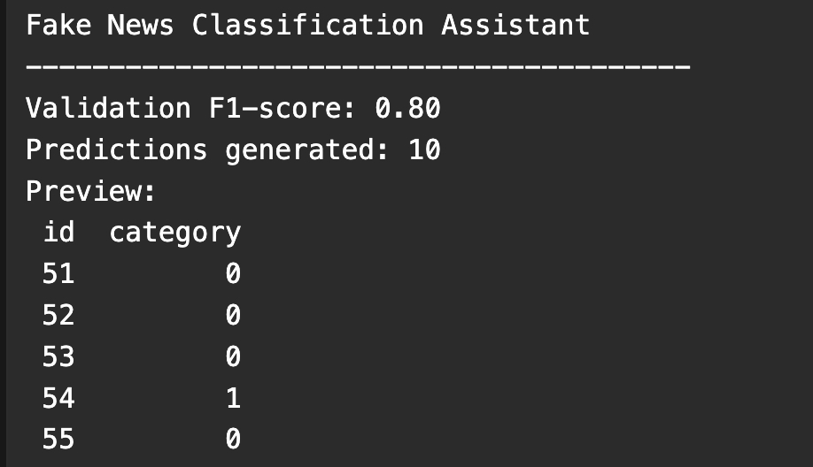

# Fake News Classification Assistant



## PT-BR

Pipeline em `PyTorch` para classificação binária de notícias, estruturado a partir do desafio original e evoluído para uma versão mais estável para portfólio. A solução implementa preparação textual, vocabulário manual, `Embedding + GRU + Sigmoid`, geração de submissão e teste automatizado do fluxo principal.

### Visão Geral Técnica

O objetivo é classificar cada notícia em:

- `0`: notícia confiável
- `1`: fake news

O pipeline recebe os campos `title`, `content` e `tags`, transforma esse conteúdo em uma sequência numérica e treina uma rede neural recorrente para prever a classe binária.

### Origem e Adaptação

O projeto nasceu a partir do desafio original, mas a base foi expandida para reduzir a instabilidade extrema de validação causada por um conjunto muito pequeno. A arquitetura central foi mantida dentro do mesmo espírito técnico:

- pipeline textual clássico;
- vocabulário manual;
- codificação por índices;
- `Embedding + GRU + camada linear + sigmoid`;
- treino supervisionado com `BCELoss`.

Em outras palavras: o desenho do modelo continua fiel à proposta original, mas os dados foram ampliados para produzir uma avaliação mais crível.

### Como o Pipeline Funciona

1. Os dados são carregados de [train.csv](/Users/flaviagaia/Documents/CV_FLAVIA_CODEX/Fake%20News%20Classification%20Assistant/data/train.csv) e [test.csv](/Users/flaviagaia/Documents/CV_FLAVIA_CODEX/Fake%20News%20Classification%20Assistant/data/test.csv).
2. Valores nulos são preenchidos com `fillna("")`.
3. Os campos textuais `title`, `content` e `tags` são concatenados em uma única coluna `text`.
4. Um vocabulário é construído manualmente a partir do conjunto de treino, com tokens especiais:
   - `<PAD> = 0`
   - `<UNK> = 1`
5. Cada texto é tokenizado por separação simples em espaços, convertido em inteiros e padronizado para um comprimento fixo.
6. O `Dataset` do PyTorch entrega pares `(sequência, rótulo)` para treino e apenas sequências para inferência.
7. A rede neural executa:
   - `Embedding(vocab_size, 64)`
   - `GRU(64, 32, batch_first=True)`
   - `Linear(32, 1)`
   - `Sigmoid`
8. O treinamento usa:
   - `Adam`
   - `BCELoss`
   - split estratificado de validação
9. O projeto calcula `F1-score` na validação e gera `submissions.csv` para o conjunto de teste.

### Arquitetura do Modelo

O modelo atual, definido em [modeling.py](/Users/flaviagaia/Documents/CV_FLAVIA_CODEX/Fake%20News%20Classification%20Assistant/src/modeling.py), segue uma arquitetura recorrente compacta:

```text
Texto -> Vocabulário -> IDs -> Embedding -> GRU -> Linear -> Sigmoid
```

Interpretação:

- `Embedding`: aprende representações densas para cada token do vocabulário.
- `GRU`: captura dependências sequenciais e resume o texto em um estado oculto final.
- `Linear`: projeta a representação semântica para uma saída binária.
- `Sigmoid`: converte a saída em probabilidade para a classe positiva.

### Configuração Atual de Treino

O treino padrão implementado em [train.py](/Users/flaviagaia/Documents/CV_FLAVIA_CODEX/Fake%20News%20Classification%20Assistant/src/train.py) usa:

- `batch_size = 1`
- `epochs = 5`
- `embedding_dim = 64`
- `hidden_dim = 32`
- `learning_rate = 0.01`
- split estratificado com `test_size = 0.2`

Essa configuração foi escolhida para evitar colapso de classe no conjunto pequeno e produzir uma validação mais crível no cenário atual.

### Métrica

`F1-score` foi mantido como métrica principal porque:

- é apropriado para classificação binária;
- penaliza cenários em que o modelo aprende só uma classe;
- oferece uma leitura melhor que acurácia quando o custo de falso positivo e falso negativo importa.

### Resultado Atual

Execução atual de [main.py](/Users/flaviagaia/Documents/CV_FLAVIA_CODEX/Fake%20News%20Classification%20Assistant/main.py):

```text
Fake News Classification Assistant
----------------------------------------
Validation F1-score: 0.80
Predictions generated: 10
Preview:
 id  category
 51         0
 52         0
 53         0
 54         1
 55         0
```

### Estrutura do Projeto

- [main.py](/Users/flaviagaia/Documents/CV_FLAVIA_CODEX/Fake%20News%20Classification%20Assistant/main.py): treino + inferência ponta a ponta
- [src/data_utils.py](/Users/flaviagaia/Documents/CV_FLAVIA_CODEX/Fake%20News%20Classification%20Assistant/src/data_utils.py): leitura e composição dos textos
- [src/modeling.py](/Users/flaviagaia/Documents/CV_FLAVIA_CODEX/Fake%20News%20Classification%20Assistant/src/modeling.py): vocabulário, dataset e modelo GRU
- [src/train.py](/Users/flaviagaia/Documents/CV_FLAVIA_CODEX/Fake%20News%20Classification%20Assistant/src/train.py): treino, split e métricas
- [src/predict.py](/Users/flaviagaia/Documents/CV_FLAVIA_CODEX/Fake%20News%20Classification%20Assistant/src/predict.py): geração de submissão
- [tests/test_pipeline.py](/Users/flaviagaia/Documents/CV_FLAVIA_CODEX/Fake%20News%20Classification%20Assistant/tests/test_pipeline.py): teste automatizado
- [data/train.csv](/Users/flaviagaia/Documents/CV_FLAVIA_CODEX/Fake%20News%20Classification%20Assistant/data/train.csv): conjunto de treino expandido
- [data/test.csv](/Users/flaviagaia/Documents/CV_FLAVIA_CODEX/Fake%20News%20Classification%20Assistant/data/test.csv): conjunto de teste expandido

### Como Executar

```bash
python3 -m venv .venv
source .venv/bin/activate
pip install -r requirements.txt
python3 main.py
```

### Como Testar

```bash
python3 -m unittest discover -s tests -v
```

### Limitações

- o dataset continua pequeno para padrões reais de NLP;
- o tokenizador é propositalmente simples para manter fidelidade ao desenho do desafio;
- o resultado ainda depende do split de validação e não substitui uma avaliação robusta em produção.

### Próximos Passos Possíveis

- comparar `GRU` com `LSTM`;
- substituir `sigmoid + BCELoss` por `BCEWithLogitsLoss`;
- adicionar validação cruzada;
- introduzir normalização textual mais forte;
- migrar para modelos contextualizados, como BERT, em uma segunda versão.

---

## EN

`PyTorch` pipeline for binary fake news classification, structured from the original challenge and evolved into a more stable portfolio-ready version. The solution implements text preparation, manual vocabulary construction, `Embedding + GRU + Sigmoid`, submission generation, and automated testing for the main workflow.

### Technical Overview

The goal is to classify each article as:

- `0`: reliable news
- `1`: fake news

The pipeline consumes `title`, `content`, and `tags`, converts them into a numerical sequence representation, and trains a recurrent neural network to predict the binary label.

### Origin and Adaptation

The project started from the original challenge, but the dataset was expanded to reduce the extreme validation instability caused by a very small training set. The core architecture was preserved within the same technical spirit:

- classic text pipeline;
- manual vocabulary;
- index-based encoding;
- `Embedding + GRU + linear layer + sigmoid`;
- supervised training with `BCELoss`.

In other words: the model design remains faithful to the original proposal, while the data was expanded to produce a more credible evaluation setup.

### How the Pipeline Works

1. Data is loaded from [train.csv](/Users/flaviagaia/Documents/CV_FLAVIA_CODEX/Fake%20News%20Classification%20Assistant/data/train.csv) and [test.csv](/Users/flaviagaia/Documents/CV_FLAVIA_CODEX/Fake%20News%20Classification%20Assistant/data/test.csv).
2. Missing values are handled with `fillna("")`.
3. The text fields `title`, `content`, and `tags` are concatenated into a single `text` column.
4. A vocabulary is manually built from the training split, with special tokens:
   - `<PAD> = 0`
   - `<UNK> = 1`
5. Each text is tokenized with whitespace splitting, converted to integer IDs, and padded/truncated to a fixed sequence length.
6. The PyTorch `Dataset` yields `(sequence, label)` pairs for training and sequences only for inference.
7. The neural network performs:
   - `Embedding(vocab_size, 64)`
   - `GRU(64, 32, batch_first=True)`
   - `Linear(32, 1)`
   - `Sigmoid`
8. Training uses:
   - `Adam`
   - `BCELoss`
   - stratified validation split
9. The project computes validation `F1-score` and generates `submissions.csv` for the test set.

### Model Architecture

The current model, defined in [modeling.py](/Users/flaviagaia/Documents/CV_FLAVIA_CODEX/Fake%20News%20Classification%20Assistant/src/modeling.py), follows a compact recurrent architecture:

```text
Text -> Vocabulary -> IDs -> Embedding -> GRU -> Linear -> Sigmoid
```

Interpretation:

- `Embedding`: learns dense vector representations for tokens.
- `GRU`: captures sequential dependencies and compresses the text into a final hidden state.
- `Linear`: projects the semantic representation into a binary output.
- `Sigmoid`: converts the output into a probability for the positive class.

### Current Training Setup

The default training configuration implemented in [train.py](/Users/flaviagaia/Documents/CV_FLAVIA_CODEX/Fake%20News%20Classification%20Assistant/src/train.py) uses:

- `batch_size = 1`
- `epochs = 5`
- `embedding_dim = 64`
- `hidden_dim = 32`
- `learning_rate = 0.01`
- stratified split with `test_size = 0.2`

This setup was selected to reduce class-collapse behavior on the small dataset and produce a more credible validation score under the current scenario.

### Metric

`F1-score` remains the main metric because it:

- is appropriate for binary classification;
- penalizes models that collapse into predicting a single class;
- is more informative than plain accuracy when both false positives and false negatives matter.

### Current Result

Current execution of [main.py](/Users/flaviagaia/Documents/CV_FLAVIA_CODEX/Fake%20News%20Classification%20Assistant/main.py):

```text
Fake News Classification Assistant
----------------------------------------
Validation F1-score: 0.80
Predictions generated: 10
Preview:
 id  category
 51         0
 52         0
 53         0
 54         1
 55         0
```

### Project Structure

- [main.py](/Users/flaviagaia/Documents/CV_FLAVIA_CODEX/Fake%20News%20Classification%20Assistant/main.py): end-to-end training and inference
- [src/data_utils.py](/Users/flaviagaia/Documents/CV_FLAVIA_CODEX/Fake%20News%20Classification%20Assistant/src/data_utils.py): data loading and text composition
- [src/modeling.py](/Users/flaviagaia/Documents/CV_FLAVIA_CODEX/Fake%20News%20Classification%20Assistant/src/modeling.py): vocabulary, dataset, and GRU model
- [src/train.py](/Users/flaviagaia/Documents/CV_FLAVIA_CODEX/Fake%20News%20Classification%20Assistant/src/train.py): training, split, and metrics
- [src/predict.py](/Users/flaviagaia/Documents/CV_FLAVIA_CODEX/Fake%20News%20Classification%20Assistant/src/predict.py): submission generation
- [tests/test_pipeline.py](/Users/flaviagaia/Documents/CV_FLAVIA_CODEX/Fake%20News%20Classification%20Assistant/tests/test_pipeline.py): automated test
- [data/train.csv](/Users/flaviagaia/Documents/CV_FLAVIA_CODEX/Fake%20News%20Classification%20Assistant/data/train.csv): expanded training dataset
- [data/test.csv](/Users/flaviagaia/Documents/CV_FLAVIA_CODEX/Fake%20News%20Classification%20Assistant/data/test.csv): expanded test dataset

### Run

```bash
python3 -m venv .venv
source .venv/bin/activate
pip install -r requirements.txt
python3 main.py
```

### Test

```bash
python3 -m unittest discover -s tests -v
```

### Limitations

- the dataset is still small compared with real-world NLP settings;
- the tokenizer is intentionally simple to preserve the spirit of the original challenge;
- the current result still depends on the validation split and should not be treated as a production-grade benchmark.

### Possible Next Steps

- compare `GRU` against `LSTM`;
- replace `sigmoid + BCELoss` with `BCEWithLogitsLoss`;
- add cross-validation;
- introduce stronger text normalization;
- migrate to contextual encoders such as BERT in a second version.
